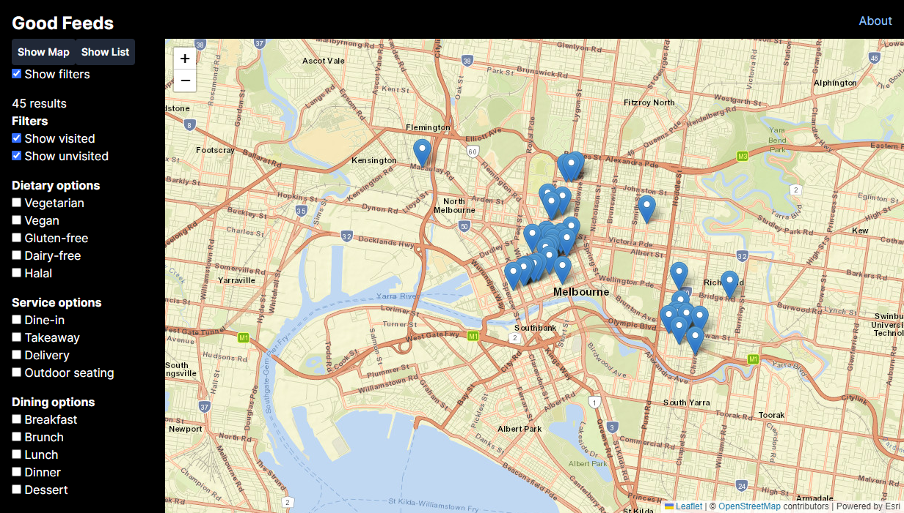

# Good Feeds 🍽



Formerly known as Good Breads 🍞

A place to find and recommend places to eat or drink.

## Development instructions
- Create database
```sql
$ mysql
source api/db/create_db.sql
```
- Configure environment variables
```sh
cp .env.example .env
# Edit .env file
```
- Install dependencies for Go server
```sh
cd api
go get .
```
- Run backend server
```sh
cd api
go run main.go
```
- Install dependencies for frontend
```sh
cd client
npm i
```
- Start frontend
```sh
npm run dev
```

## Architecture Decisions

This project uses [Architecture Decision Records](https://adr.github.io/) to capture the rationale behind architecturally significant decisions. They can be found at [`doc/architecture/decisions`](doc/architecture/decisions)
