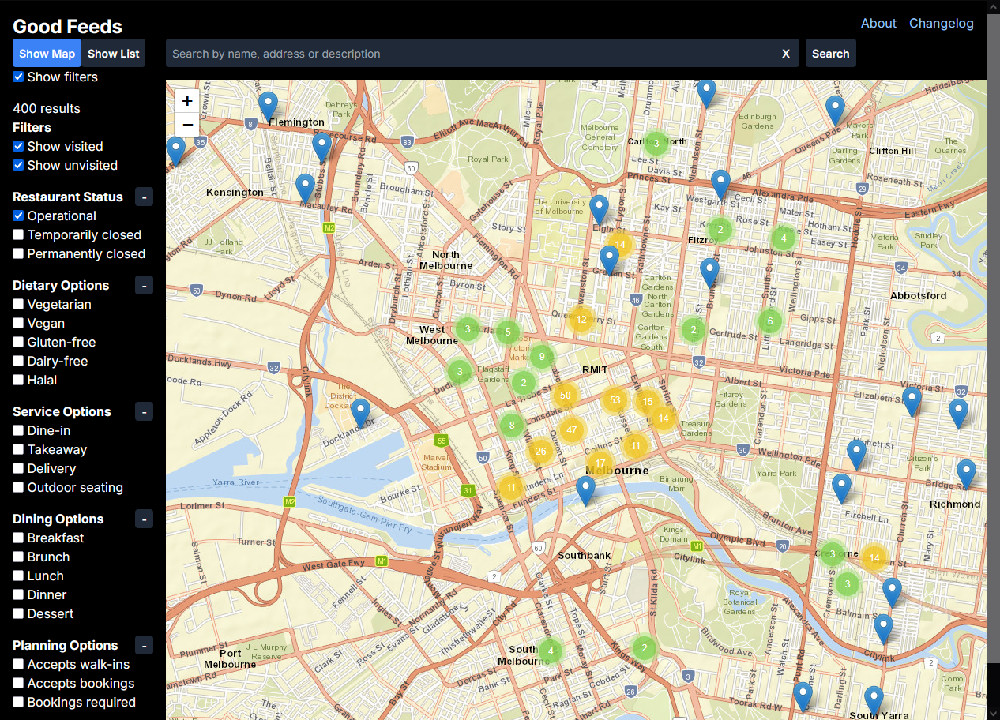

# Good Feeds 🍽

Frontend hosted at https://pakkudon.github.io/good-feeds/



Formerly known as Good Breads 🍞

A site to find places to eat or drink at around Melbourne, VIC Australia.

## Updates

See [CHANGELOG.md](./CHANGELOG.md)

## Development instructions
### Prerequisites
To run this locally you will need the following:
- Go 1.21
- A MySQL server
- Node.js v20 or higher

### Backend server setup
Create database
```sql
$ mysql
CREATE DATABASE good_feeds;
```
Configure environment variables
```sh
cp .env.example .env
# Edit .env file to set database URL and other options
```
Install dependencies for Go server
```sh
cd api
go get .
```
Run database migrations
```sh
cd api
go run cmd/migrate.go
```
Run backend server
```sh
cd api
go run main.go
```

### Frontend setup
Install dependencies for frontend
```sh
cd client
npm i
```
Start frontend
```sh
npm run dev
```

## Architecture Decisions

This project uses [Architecture Decision Records](https://adr.github.io/) to capture the rationale behind architecturally significant decisions. They can be found at [`doc/architecture/decisions`](doc/architecture/decisions)
