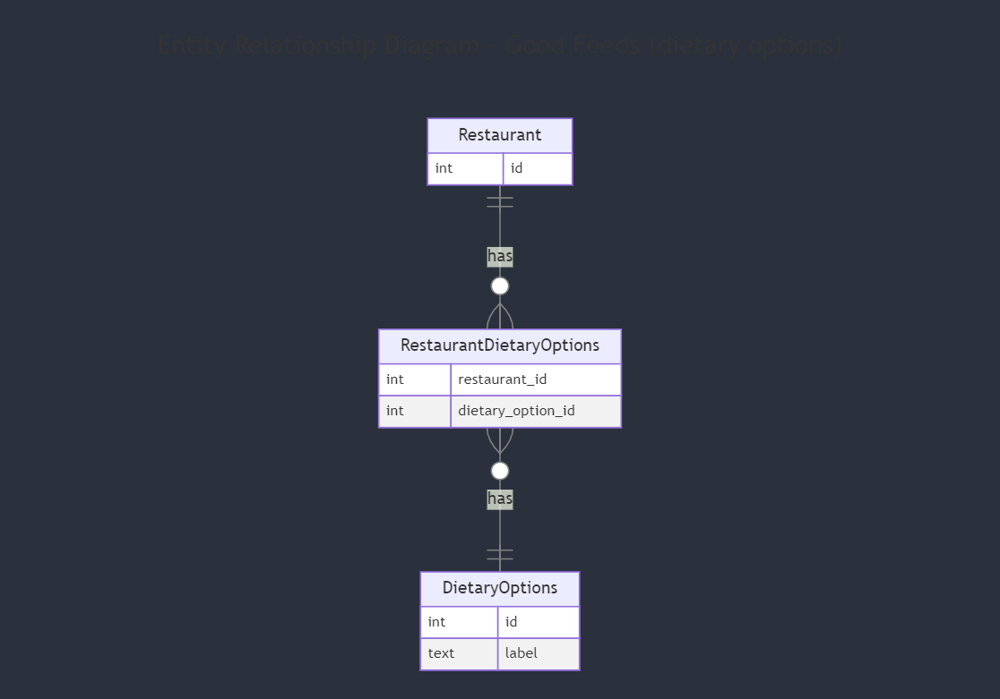
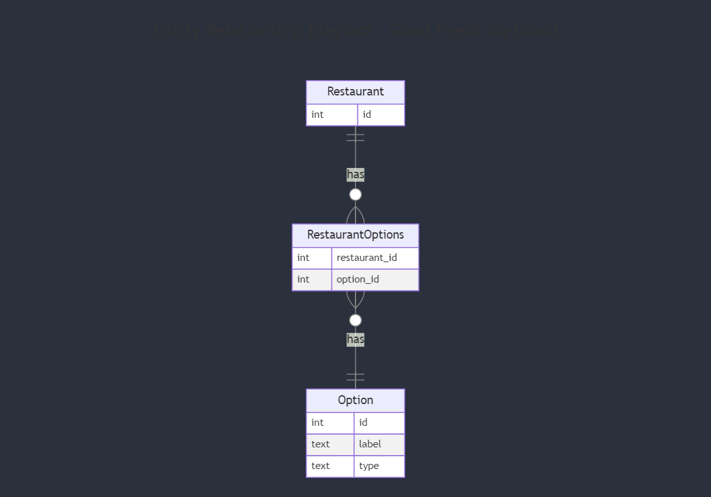

# 6. Generalise restaurant options table

Date: 2024-01-14 (Backfilled on 2024-01-25)

## Status

Accepted

## Context

Prior to this decision being implemented, Good Feeds had a `dietary_options` table to record dietary options that restaurants could potentially cater to. There was a join table `restaurant_dietary_options` as restaurants could cater to many dietary options and dietary options could be catered for by multiple restaurants.

The backend has an API that returns a list of these dietary options so that the frontend can present them to users. Users then use this list to filter restaurants according to their dietary requirements.

Dietary requirements are not the only the consideration when picking a place to dine at. Users may also want to filter restaurants by other things such as:
- Available dining options (eg: breakfast, lunch, dinner)
- Price point
- Whether restaurants take bookings or walk-ins

The existing `dietary_options` table is too specific a name for this purpose.

## Decision

- The `dietary_options` table will be replaced by a generic `options` table which will store types or attributes that users can filter by (eg: dietary options, service options)
- The `restaurant_dietary_options` will be replaced by a `restaurant_options` table as it now tracks more than dietary options
- In addition to a `label` value (the text associated with an option), `option`s will also have a `type`. This will determine how different options are grouped in the UI.

## Consequences

- New filter types or options can be introduced by adding records to the `options` table. Previously this may have involved adding a new table
- Changes to available options or types can no longer be observed through database schema changes
